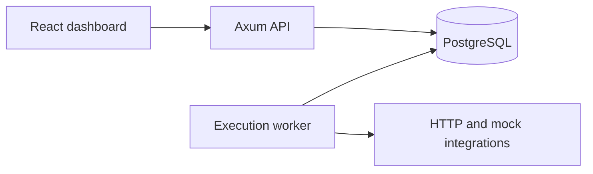

# Relay-Flow

[](https://github.com/mr2buzi/Relay-Flow/actions/workflows/ci.yml)

Relay-Flow is a durable execution engine for API and AI workflows. It focuses on the failure modes that appear after a workflow leaves a single process: retries, idempotency, persisted state, recovery and deterministic branching.

## Capabilities

- Published and versioned workflow definitions
- Durable sequential step execution
- Automatic retries with backoff
- Idempotent workflow triggering
- Persisted step and run history
- Dead-letter handling, retry-now and replay
- Conditional `if` steps with persisted branch decisions
- Filtering and operational visibility through a React dashboard
- Mock integrations for a zero-secret local demo

## Architecture



- `apps/api`: Axum HTTP API
- `apps/worker`: asynchronous execution worker
- `apps/dashboard`: React/Vite operations dashboard
- `crates/engine`: shared models, persistence, worker logic, migrations and seed data
- PostgreSQL: workflow definitions, runs, steps, context and recovery state

The runtime uses at-least-once execution. Runs bind to a published workflow version, and replay creates a new run instead of rewriting historical state.

Branching deliberately avoids a full DAG scheduler. An execution plan and the selected branch are persisted in run context, keeping retries and replay deterministic while the engine remains sequential.

## Example workflow

```json
{
  "workflow": "user_signup",
  "steps": [
    { "type": "http", "url": "mock://stripe/customers" },
    { "type": "http", "url": "mock://resend/send" },
    { "type": "if" },
    { "type": "db.postgres" }
  ]
}
```

The worker persists state after each transition, schedules retryable failures and records the information needed for debugging and recovery.

## Run locally

Prerequisites: Docker Desktop, Rust, Node.js 22+ and npm.

```bash
docker compose up --build
```

- Dashboard: `http://localhost:5173`
- API: `http://localhost:8000`
- PostgreSQL: `localhost:5432`
- Demo API key: `demo_api_key`

To run services separately:

```bash
cargo run -p workflow-api
cargo run -p workflow-worker
cd apps/dashboard
npm install
npm run dev
```

## API

Workflow lifecycle:

- `POST /v1/workflows`
- `PUT /v1/workflows/:id/draft`
- `POST /v1/workflows/:id/publish`
- `POST /v1/workflows/:slug/run`
- `POST /v1/webhooks/:token`
- `GET /v1/workflows/:id/history`

Operations and recovery:

- `GET /v1/runs`
- `GET /v1/runs/:id`
- `GET /v1/dead-letters`
- `POST /v1/runs/:id/retry-now`
- `POST /v1/runs/:id/replay`
- `GET /v1/usage`

## Verification

```bash
cargo check
cargo test
cd apps/dashboard && npm run build
```

## Scope

Relay-Flow currently favours operational clarity over breadth: sequential execution rather than full DAG scheduling, mock-first integrations rather than secret-heavy live connectors, and a single-workspace local setup rather than multi-tenant billing and authentication.
